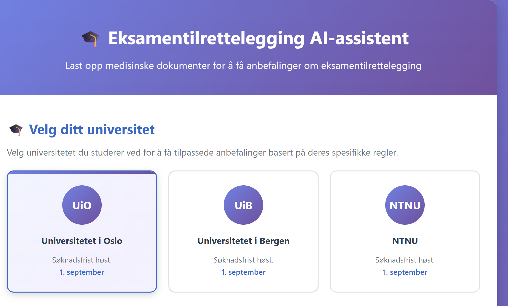
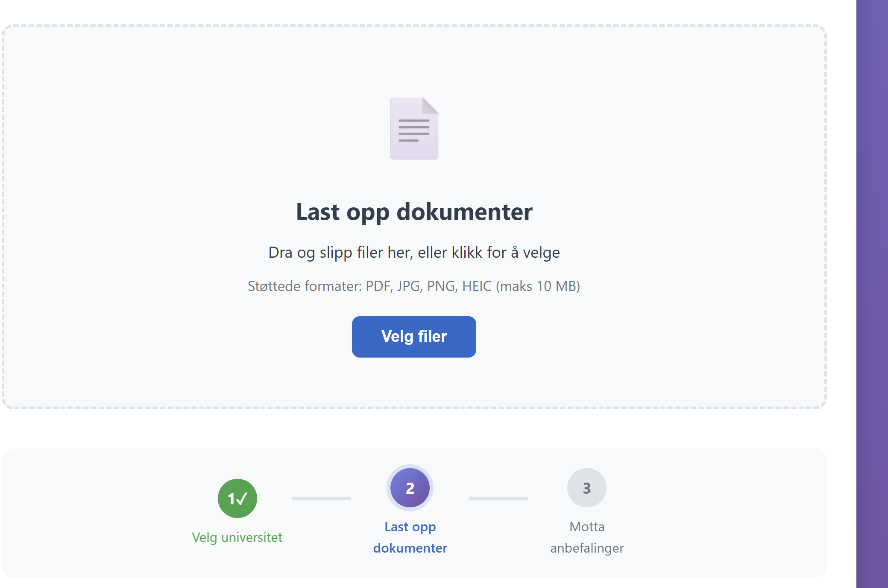
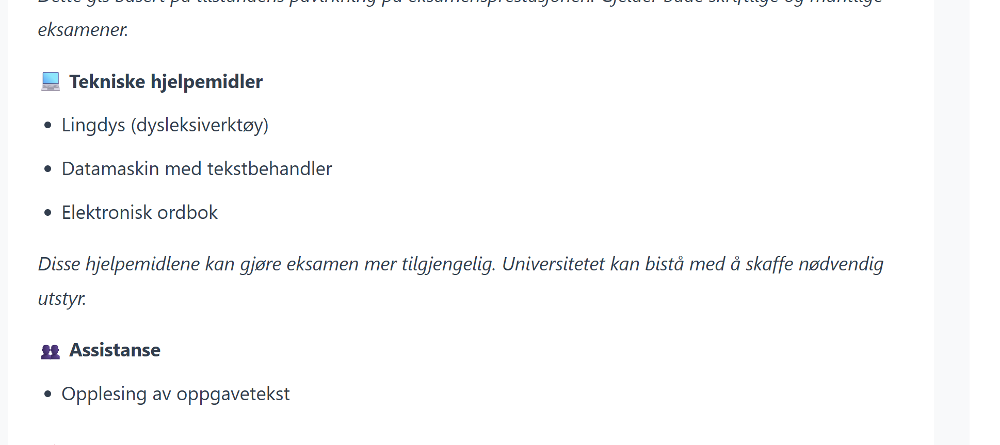
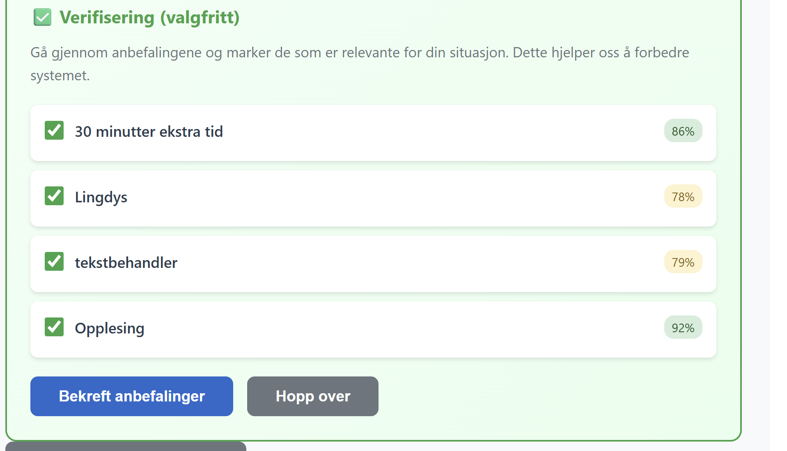
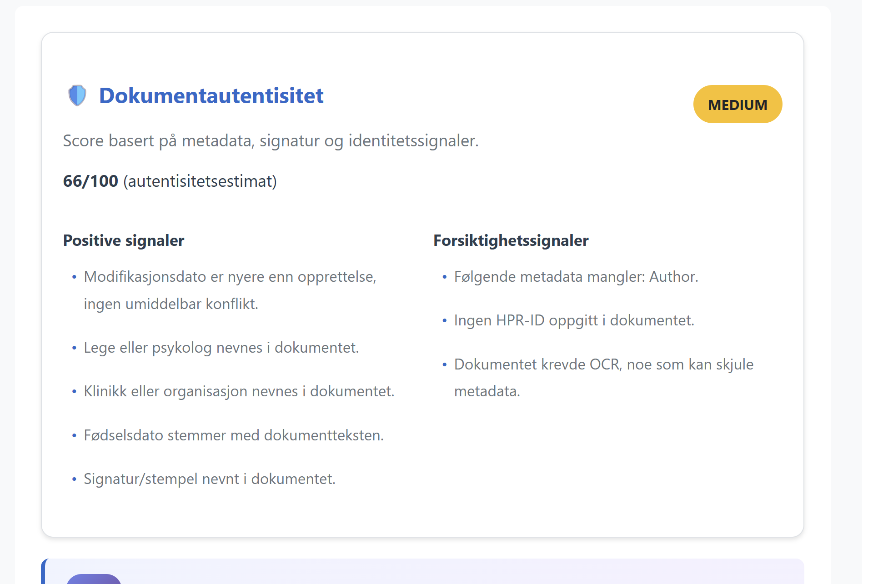

# Eksamentilrettelegging AI-assistent

An AI-powered system that analyzes Norwegian medical documentation and generates exam accommodation recommendations for university students.

---

## Overview

Students with documented disabilities are entitled to exam accommodations at Norwegian universities, but manual case review is slow and inconsistent. This tool helps coordinators by automatically parsing medical records, identifying relevant diagnoses and functional limitations, and mapping them to standard accommodation categories — all in seconds.

Supported universities: **UiO**, **UiB**, **NTNU**

---

## How it works

### 1. Select your university

The student selects their university so recommendations are tailored to that institution's specific accommodation rules and deadlines.



---

### 2. Upload medical documentation

Drag and drop (or select) Norwegian medical documents. Supported formats: PDF, JPG, PNG, HEIC (max 10 MB).



---

### 3. Receive AI-generated recommendations

The system extracts diagnoses and functional impact from the documents and maps them to concrete accommodation categories — such as extended time, technical aids (Lingdys, word processor, electronic dictionary), separate exam room, or reading assistance.



---

### 4. Verify and confirm

Each recommendation is shown with a confidence score. The coordinator (or student) reviews the list and confirms which apply before the report is finalized.



---

### 5. Document authenticity check

The system also scores the uploaded document for authenticity based on metadata, signatures, and identity signals — flagging missing HPR-IDs, absent author fields, or OCR-processed files that may obscure metadata.



---

## Tech stack

- **Runtime:** Node.js
- **Language processing:** Norwegian NLP
- **Deployment:** Docker / Docker Compose
- **API:** OpenAPI 3.0

## Getting started

```bash
# Clone the repo
git clone https://github.com/jakobkoding2/tilrettelegging-bot.git
cd tilrettelegging-bot

# Start with Docker Compose
docker-compose up
```

See [DEPLOYMENT_GUIDE.md](DEPLOYMENT_GUIDE.md) for full setup instructions.

---

## Background

Norwegian universities are legally required to offer exam accommodations to students with documented disabilities. Manual assessment of applications is time-consuming and prone to inconsistency between reviewers. This system assists coordinators by providing evidence-based AI recommendations derived directly from the submitted medical documentation, making the process faster and more uniform.
